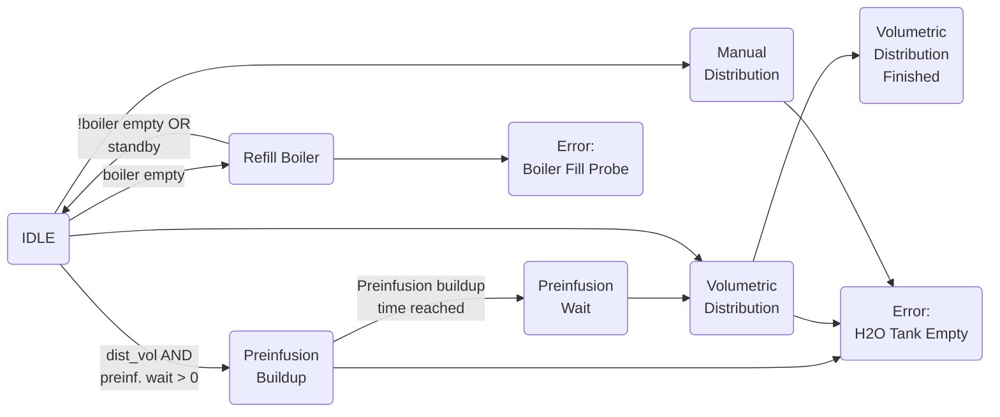
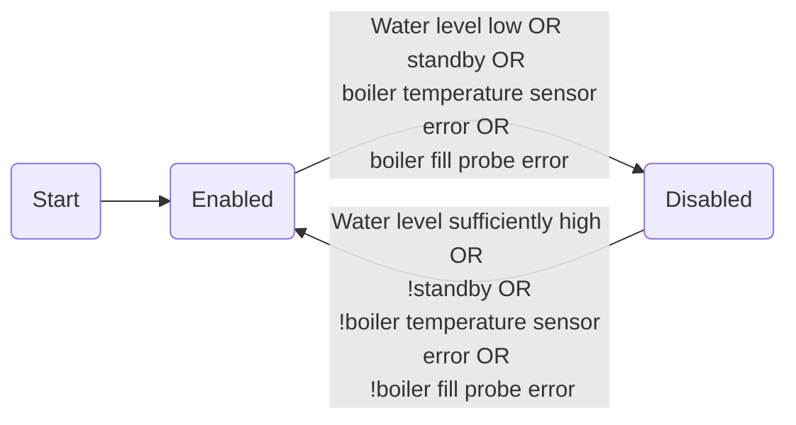
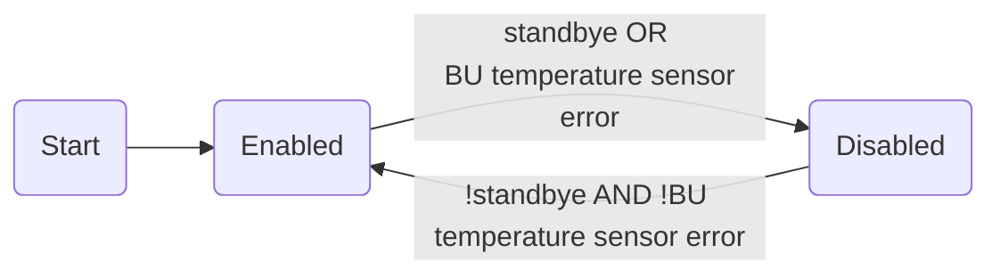
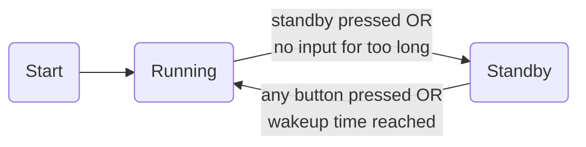

# Bezzera BZ10 Upgrade
This Project is a replacement for the original Bezzera BZ10 electronics bringing many new features including the following:
- Temperature regulation for boiler and brewing unit
- Volumetric brewing system based on water flow instead of time only
- Standby functionality
- Automated wake up from standby, so that the machine is heated up already when you get up in the morning
- Display of various temperatures, volume distributed and distribution time
- Preinfusion (time based)
- WIFI: All parameters (temperatures, distribution volume, wake up time, etc.) can be set with a smartphone
- Automated cleaning cycle: Ten cycles of switching distribution on and off for 20 seconds each by pressing only one button

## Building the project
## Setting your WiFi credentials
## Setting up Blynk
You can use the following virtual pins for communication with your espresso machine:
- V1: Boiler temperature in °C (display)
- V2: BU temperature in °C (display)
- V3: Tube temperature in °C (display)
- V4: Boiler target temperature in °C (Numeric Input widget, values 0-120, step size 0.5)
- V5: Brewing unit target temperature in °C (Numeric Input widget, values 0-110, step size 0.5)
- V6: Distribution volume in ml (Numeric Input widget, values 1-200, step size 1, only integers allowed)
- V7: Volume offset in ml. This makes up for the water going through the hx but not into the cup (Numeric Input widget, values 0-100, step size 1, only integers allowed)
- V8: Boiler heater controller P parameter (input)
- V9: BU heater controller P parameter (input)
- V10: Preinfusion buildup time in s (input, fractions ok)
- V11: Preinfusion wait time in s (input, fractions ok)
- V12: Standby wakup timer: in s after midnight (use Blynk time widget, reset widget or set to 0:00 to disable)
- V13: Standby start time: time in s after which the machine goes into standby mode if no user interaction occurs (us Blynk time widget, reset widget or set to 0:00 to disable)
You can use a SuperChart Widget for V1-V3
## Code overview
The machine functionality is based on state machines. There are two state machines for boiler and brewing unit temperature control. Another state machine controls the brewing cycle, one is used for the display, and a last one is responsible for the overall machine state including standby functionality. All state machines are visually shown under `/State machines/State machines.odg`. 
In order to make the program more flexible for other hardware, a hardware abstraction class has been written (`dev.c`). Adapting this class will allow the project to run on a different hardware as well.
Besides machine logic, a faster library for TSIC temperature sensors has been developed.
### Brewing state machine
**not complete yet**

### Boiler heater state machine

### Brewing unit heater state machine

### Display state machine
### Machine status state machine

<!--stackedit_data:
eyJoaXN0b3J5IjpbLTc4MTAxOTMxNSwtMTcxMjU0Nzg0LDIxMT
QyNjI3NTAsLTE2NTAxMjgwMDVdfQ==
-->