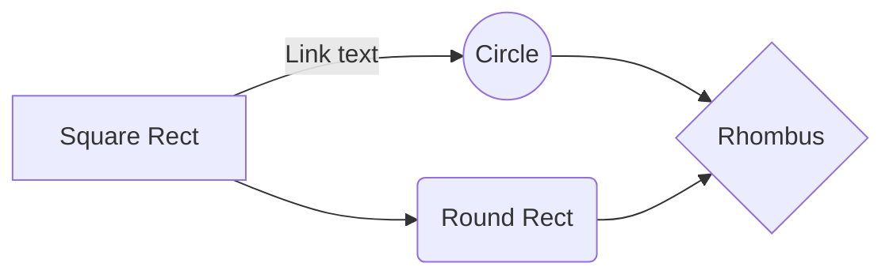
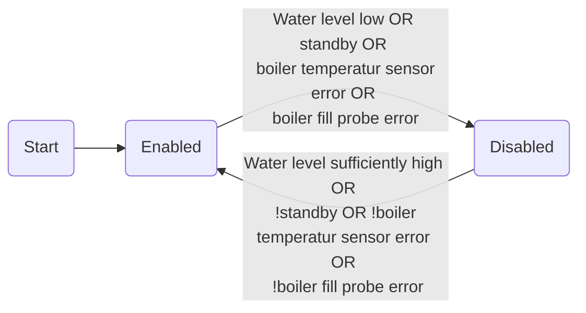

# Bezzera BZ10 Upgrade
This Project is a replacement for the original Bezzera BZ10 electronics bringing many new features including the following:
- Temperature regulation for boiler and brewing unit
- Volumetric brewing system based on water flow instead of time only
- Standby functionality
- Automated wake up from standby, so that the machine is heated up already when you get up in the morning
- Display of various temperatures, volume distributed and distribution time
- Preinfusion (time based)
- WIFI: All parameters (temperatures, distribution volume, wake up time, etc.) can be set with a smartphone
- Automated cleaning cycle: Ten cycles of switching distribution on and off for 20 seconds each by pressing only one button

## Building the project
## Setting up Blynk
## Code overview
The machine functionality is based on state machines. There are two state machines for boiler and brewing unit temperature control. Another state machine controls the brewing cycle, one is used for the display, and a last one is responsible for the overall machine state including standby functionality. In order to make the program more flexible for other hardware, a hardware abstraction class has been written (`dev.c`). Adapting this class will allow the project to run on a different hardware as well.
Besides machine logic, a faster library for TSIC temperature sensors has been developed.
### Brewing state machine
### Boiler heater state machine



### Brewing unit heater state machine
```ermaid
graph LR

```
### Display state machine
### Device status state machine
<!--stackedit_data:
eyJoaXN0b3J5IjpbLTEzMDk0NDY5MDUsLTE2NTAxMjgwMDVdfQ
==
-->